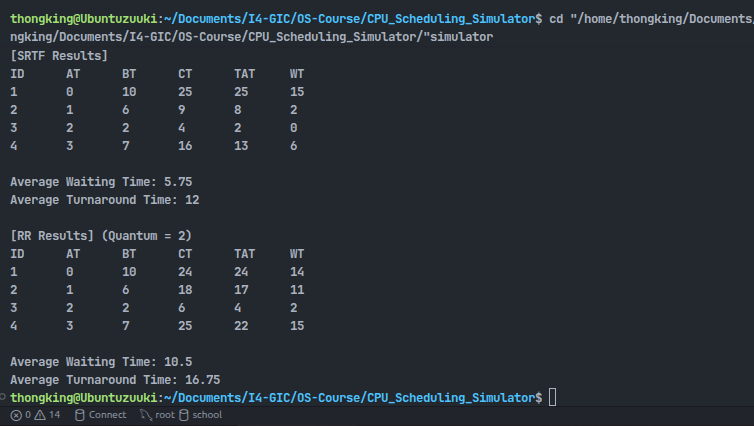

# 🖥️ CPU Scheduling Simulator


-lightgrey?style=for-the-badge)


> **A component of the OS-Lab course (GIC Department, I4).**
>
> This simulator simulates the behavior of various CPU scheduling algorithms, calculating key performance metrics (**Waiting Time**, **Turnaround Time**, **Response Time**) and visualizing the execution order using a text-based **Gantt Chart**.

---

## 📖 Table of Contents
- [Project Overview](#-project-overview)
- [Supported Algorithms](#-supported-algorithms)
- [Prerequisites & Installation](#-prerequisites--installation)
- [Input Formatting](#-input-formatting)
- [Usage & Commands](#-usage--commands)
- [Output Examples](#-output-examples)

---

## 🧠 Supported Algorithms

This simulator implements the following five scheduling policies:

| Algorithm | Type | Description |
| :--- | :--- | :--- |
| **FCFS** (First Come First Serve) | Non-Preemptive | Processes are executed strictly in the order of arrival. Simple but can lead to high waiting times. |
| **SJF** (Shortest Job First) | Non-Preemptive | Selects the process with the smallest **Burst Time**. Runs to completion once started. |
| **SRT** (Shortest Remaining Time) | **Preemptive** | The preemptive version of SJF. Switches immediately if a new process arrives with a shorter remaining time. |
| **RR** (Round Robin) | **Preemptive** | Assigns fixed time slots (**Quantum**). If unfinished, the process moves to the back of the queue. *(Default Quantum: 2)* |
| **MLFQ** (Multilevel Feedback Queue) | **Complex** | A 3-level queue system handling processes based on CPU bursts and aging. |

### 🔍 MLFQ Logic Details
The Multilevel Feedback Queue is implemented with the following hierarchy:
* **Queue 1 (High Priority):** Round Robin (Quantum = 2)
* **Queue 2 (Medium Priority):** Round Robin (Quantum = 4)
* **Queue 3 (Low Priority):** FCFS
* **Features:**
    * **Demotion:** Processes consuming their full quantum move down a priority level.
    * **Aging:** Processes waiting too long in lower queues are promoted to prevent starvation.

---

## ⚙️ Prerequisites & Installation

### System Requirements
* **C++ Compiler:** `g++` (MinGW for Windows or standard GCC for Linux/macOS).
* **Git:** To clone the repository.

### Setup Steps

1.  **Clone the Repository:**
    ```bash
    git clone <your-repo-url>
    cd <your-repo-folder>
    ```

2.  **Switch to Simulator Branch:**
    ```bash
    git checkout CPU_Scheduling_Simulator
    ```

3.  **Compile the Code:**
    ```bash
    g++ main.cpp -o scheduler
    ```
    *(Note: Replace `main.cpp` with your actual source filename if different).*

---

## 📂 Input Formatting

### File Format
The simulator reads process data from a text file (e.g., `process.txt`). Ensure this file is in the same directory as the executable.

```


```
### ScreenShots Format 
4. Screenshots or Gantt chart output
ProcessID   ArrivalTime   BurstTime   Priority(Optional)


```


