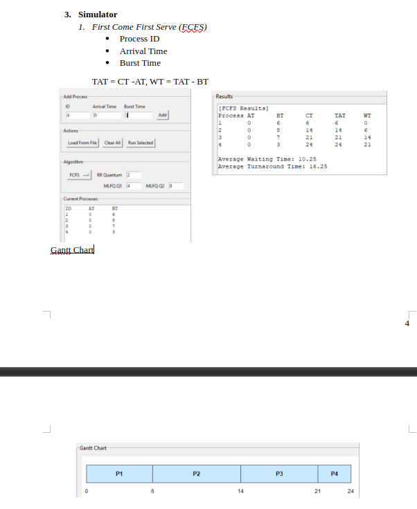
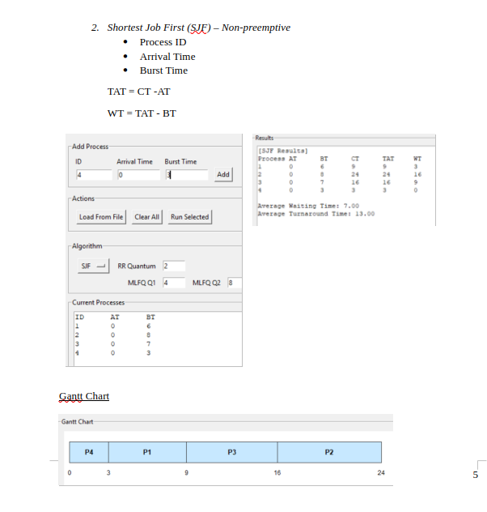
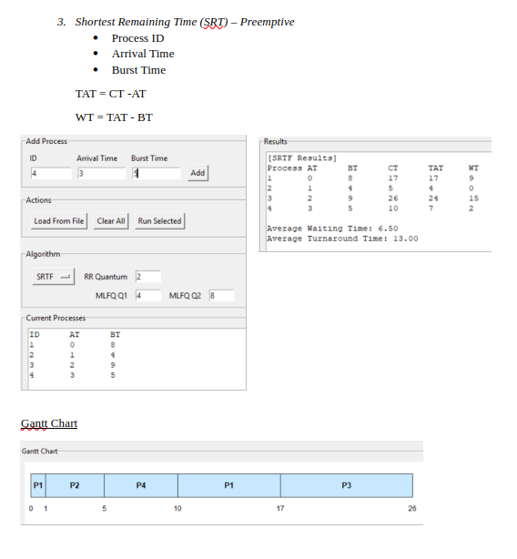
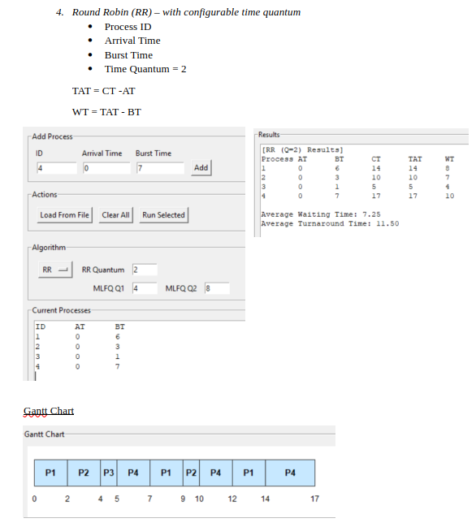
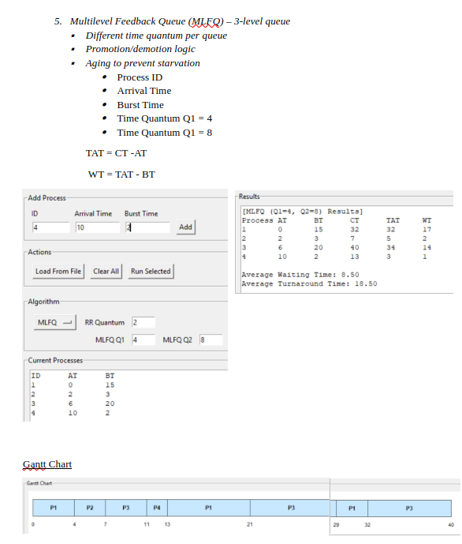

# 🖥️ CPU Scheduling Simulator (Python + Tkinter)

This project provides a GUI-based CPU scheduling simulator written in Python. It calculates **Waiting Time** and **Turnaround Time**, and shows a **Gantt Chart** for each scheduling algorithm.

---

## ✅ Setup Instructions

### Requirements
- Python 3 (Tkinter is included by default in most Python installs)

### Run the GUI
1. Open a terminal in this folder:
	- CPU_Scheduling_Simulator/
2. Run the app:
	- python3 algorithm.py

---

## 🧠 Algorithms Implemented

**FCFS (First Come First Serve)**
- Non-preemptive
- Executes processes in arrival order.

**SJF (Shortest Job First)**
- Non-preemptive
- Chooses the process with the smallest burst time among arrived processes.

**SRTF (Shortest Remaining Time First)**
- Preemptive
- Always selects the process with the smallest remaining time.

**RR (Round Robin)**
- Preemptive
- Each process runs for a fixed quantum, then moves to the back of the queue.

**MLFQ (Multilevel Feedback Queue)**
- Multi-level queue scheduling
- Queue 1: RR (Q1)
- Queue 2: RR (Q2)
- Queue 3: FCFS

---

## ▶️ How to Run Each Scheduler

1. Start the GUI:
	- python3 algorithm.py
2. Load data:
	- Click **Load From File** (or add processes manually).
3. Choose the algorithm:
	- Select FCFS, SJF, SRTF, RR, or MLFQ from the dropdown.
4. Set parameters (if needed):
	- RR: set **RR Quantum**
	- MLFQ: set **Q1** and **Q2**
5. Click **Run Selected** to view:
	- Results table (CT, TAT, WT)
	- Gantt chart visualization

---

## 📂 Input File Format

Each line:
ProcessID  ArrivalTime  BurstTime

Example:
1 0 5
2 1 3
3 2 8
4 3 6

---

## 📸 Example Output

1. FCFS

2. SJF

3. SRT

4. RR

5. MLFQ

---

## 🧩 Implementation Notes (algorithm.py)

**Core data model**
- `Process` fields: `pid`, `arrival_time`, `burst_time`, `remaining_time`, `completion_time`, `turnaround_time`, `waiting_time`.

**Input**
- Loads from a text file with lines: `ProcessID ArrivalTime BurstTime`.
- You can also add processes manually from the GUI.

**Scheduling functions**
- `simulate_fcfs(processes)` → Non‑preemptive, arrival order.
- `simulate_sjf(processes)` → Non‑preemptive shortest burst among arrived.
- `simulate_srtf(processes)` → Preemptive shortest remaining time.
- `simulate_rr(processes, quantum)` → Preemptive round‑robin with time quantum.
- `simulate_mlfq(processes, q1, q2)` → 3‑level MLFQ (Q1 RR, Q2 RR, Q3 FCFS).

**Gantt chart**
- Each scheduler returns segments `(pid, start, end)`.
- `pid = -1` is shown as IDLE time.

**GUI behavior**
- Choose algorithm from dropdown.
- Set RR quantum or MLFQ Q1/Q2 when needed.
- Click **Run Selected** to display the results table and Gantt chart.
